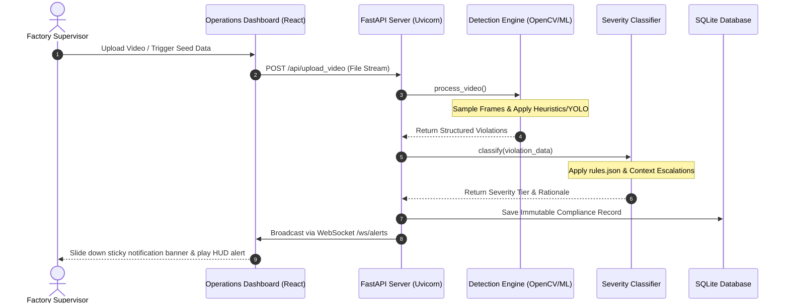

# 🛡️ FactoryGuard: Factory Compliance & Alert Escalation System

FactoryGuard is an enterprise-grade safety auditing and compliance auditing application. It ingests camera feeds from production floors, detects safety protocol violations (such as walkway breaches, forklift overloads, open electrical panels, and unauthorized equipment interventions), categorizes their severity based on compliance policy rules, and broadcasts real-time alerts.

---

## 📸 Interactive Screenshot Gallery
To show the full visual experience of your system, capture **7 screenshots** and save them directly in your project root folder. The gallery is structured with a large **Hero Image** followed by two compact rows illustrating key components:

### 1. The Big Picture (Main Dashboard View)
> **How to capture**: Open `http://localhost:5173`, click **"Seed Demo"** or upload a sample video, and capture the entire browser window showing the active live monitoring dashboard.
> **Filename**: Save as `dashboard_hero.png` in the project root.

<p align="center">
  
</p>

### 2. Operational Features Grid
> **How to capture**:
> - **Left**: Zoom/Crop onto the Live Video Panel with the HUD elements and overlay bounding boxes. Save as `live_feed_detail.png`.
> - **Middle**: Zoom/Crop onto the Historical Audit Log table showing color-coded confidence logs. Save as `historical_logs.png`.
> - **Right**: Zoom/Crop onto the Active Filters bar with selects, date inputs, and the active counter. Save as `filter_toolbar.png`.

<table width="100%">
  <tr>
    <td width="33.3%" align="center"><b>A. Live HUD Monitor</b></td>
    <td width="33.3%" align="center"><b>B. Compliance Audit Logs</b></td>
    <td width="33.3%" align="center"><b>C. Filter & Query Tools</b></td>
  </tr>
  <tr>
    <td></td>
    <td></td>
    <td></td>
  </tr>
</table>

### 3. Escalation & Documentation Assets
> **How to capture**:
> - **Left**: Crop the slide-down premium notification banner when a `CRITICAL` alert triggers. Save as `alert_notification.png`.
> - **Middle**: Crop the topbar stats counter pills showing count distributions. Save as `severity_metrics.png`.
> - **Right**: Capture a screenshot of the interactive Swagger API documentation at `http://localhost:8000/docs`. Save as `api_docs.png`.

<table width="100%">
  <tr>
    <td width="33.3%" align="center"><b>D. Real-time Sticky Alerts</b></td>
    <td width="33.3%" align="center"><b>E. Count Metrics</b></td>
    <td width="33.3%" align="center"><b>F. Swagger API Specs</b></td>
  </tr>
  <tr>
    <td></td>
    <td></td>
    <td></td>
  </tr>
</table>

---

## 🛠️ Technology Stack
The application is decoupled into independent layers using standard, modern technologies:
- **Backend Core**: Python 3.10+, FastAPI (Asynchronous high-performance web framework).
- **Frontend Dashboard**: React 18, Vite (Fast build tool), TypeScript.
- **Styling**: Pure CSS Custom Properties (Glassmorphic dark design system, grid layouts, custom animation timelines).
- **Database**: SQLite with SQLAlchemy ORM (Lightweight, zero-config relational store).
- **Real-Time Pipeline**: WebSockets (FastAPI WebSocket endpoints for instant, zero-latency frontend dispatches).
- **Vision Libraries**: OpenCV (Video frame extraction and processing) & YOLOv8 (ultralytics) hooks for object classification.

---

## 📐 System Architecture & Data Flow


---

## 🧠 ML Detection & Severity Classification Pipeline

### 1. Detection Engine (`src/detection/detector.py`)
- **Frame Sampling**: Extracts frames from incoming video streams at a configurable rate (`DETECTION_FRAME_STRIDE`).
- **Hybrid Heuristics**: 
  - **Walkway Breach**: Uses a person-detector to identify humans. The lower body region is analyzed to check the ratio of green pixels below their feet (`green_pixel_ratio`). A ratio below `5%` green triggers a walkway violation.
  - **Forklift Overload**: Detects forklift shapes and counts active rectangular blocks stacked on top. Stack count $\ge 3$ triggers a critical violation.
- **Dataset Label Fallback**: For dataset testing, if no active detection is made, the engine falls back to analyzing folder labels in the file path to ensure test coverage.

### 2. Severity Classification (`src/severity/classifier.py`)
Violations are mapped against policy guidelines (`src/severity/rules.json`):
- **Base Severity Tiers**: Sets baseline severities (e.g., Opened Panel is `MEDIUM`, Unauthorized Intervention is `HIGH`).
- **Dynamic Context Escalation**:
  - A Walkway Violation ($MEDIUM$) is escalated to **$HIGH$** if the worker is within $1.0\text{m}$ of heavy machinery or if forklift operations are active.
  - An Unauthorized Intervention ($HIGH$) is escalated to **$CRITICAL$** if multiple unauthorized workers are present.

---

## 📂 Labeled Dataset Structure
To train custom models or run path validations, organize the video dataset as follows:
```text
data/
├── train/
│   ├── Safe_Walkway_Violation/             # Persons walking off marked pathways
│   ├── Unauthorized_Intervention/          # Interactions with active equipment without vest
│   ├── Opened_Panel_Cover/                 # Exposed electrical panels
│   └── Carrying_Overload_with_Forklift/    # Excessive block counts on forks
└── test/
    ├── [Same Category Folders]
    └── Safe_Walkway/                       # Non-violating walkway runs
```

---

## 🚀 Setup & Execution Guide

### 1. Prepare Environment & Database
Open your **Command Prompt** and run:
```cmd
# Navigate to the project folder
cd d:\internshiptask\factory-compliance-system

# Create and activate Python environment
python -m venv venv
venv\Scripts\activate

# Install dependencies
pip install -r requirements.txt

# Run SQLite table setup
python src/database_init.py
```

### 🎥 Generate Sample Testing Clips
Generate small test clips to run through the compliance pipeline:
```cmd
python generate_samples.py
```
This generates 4 video clips inside `samples/` designed to trigger the different pipeline violation rules automatically.

---

### 2. Launch Services (Two Command Prompts Required)

#### Prompt Window A: Backend API Service
```cmd
# Make sure venv is active
venv\Scripts\activate
python src/main.py
```
*Backend listens on **`http://localhost:8000`***

#### Prompt Window B: Operations Dashboard React App
```cmd
cd src/dashboard
npm install
npm run dev
```
*Frontend listens on **`http://localhost:5173`***

---

## 🧪 Automated Testing
Verify the pipeline, severity categories, and database write functionality:
```cmd
venv\Scripts\activate
python -m pytest tests
```
