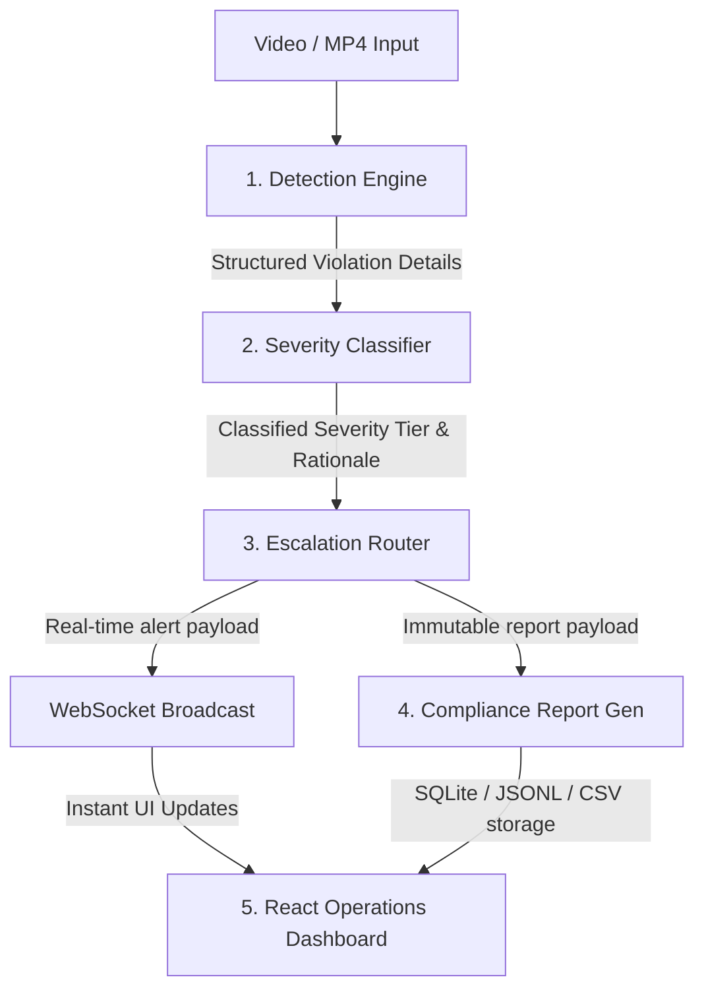

# 📹 Factory Compliance & Alert Escalation System

An enterprise-ready, automated safety monitoring application designed to audit workplace safety. The system ingests video feeds, detects compliance violations in real time, classifies their severity based on structured policy rules, and triggers instant alerts and immutable records for audit reviews.

---

## 🚀 Quick Troubleshooting: "Failed to Fetch" or Empty Dashboard?
If your dashboard shows **`Failed to Fetch`** next to the Refresh button or fails when clicking **"▶ Run Detection"**, it means the frontend is unable to reach the backend API server.
1. **Ensure the Backend is Running**: You must have the FastAPI server running. Open a Command Prompt, run `venv\Scripts\activate` and then `python src/main.py`. Keep that window open.
2. **Check the Port**: The backend runs on `http://localhost:8000` by default. Verify that no other software is using port 8000.
3. **Check Console/Network Logs**: Press `F12` in Chrome/Edge, go to the "Console" tab, and see if there are any connection or CORS errors.

---

## 📸 Dashboard Screenshots (Placeholders)
To show off the premium user interface of your system, take the following screenshots of your dashboard in the browser and replace these placeholder sections with your images:

### 1. Main Live Monitor HUD & Real-Time Alerts
> **How to capture**: Open `http://localhost:5173`, upload `samples/Safe_Walkway_Violation.mp4` or click **"Seed Demo"**, wait for the violation to trigger, and capture the screen showing the red/orange alert banner at the top, the HUD scan line, and the detection boxes.
> 
> *Replace the image below with your screenshot (name it `live_feed_monitor.png` in the project root):*
> 
> 

### 2. Historical Logs, Filters & Exports
> **How to capture**: Click on the **"Historical Log"** tab in the dashboard, apply a filter (e.g., select `HIGH` severity or `Safe_Walkway_Violation`), and capture the filter controls and formatted compliance logs table.
> 
> *Replace the image below with your screenshot (name it `historical_logs.png` in the project root):*
> 
> 

---

## 🛠 System Architecture

The application is built modularly into five distinct components to ensure decoupling and reliability:



1. **Detection Engine (`src/detection`)**: Decodes video streams, samples frames at custom intervals, and applies object detection models or boundary heuristics to flag unsafe events.
2. **Severity Classifier (`src/severity`)**: Matches detected violations against rules in `rules.json` to categorize events as `LOW`, `MEDIUM`, `HIGH`, or `CRITICAL`.
3. **Escalation Router (`src/escalation`)**: Distributes alerts based on severity. High-risk events (HIGH/CRITICAL) trigger immediate supervisor notifications.
4. **Report Generator (`src/reports`)**: Saves logs to a SQLite database, CSV logs, and JSON Lines format for audit readiness.
5. **Operations Dashboard (`src/dashboard`)**: A premium, responsive glassmorphic dark-mode web application showing real-time video monitors, active timelines, and filterable audit archives.

---

## ⚡ Features Checklist

- [x] **Real-time Video Processing**: Ingests video clips via path or interactive drag-and-drop file upload.
- [x] **Custom Detection Heuristics**: Detects walkway boundaries, forklift overloads, panel cover statuses, and unauthorized zone interventions.
- [x] **Smart Severity Classifier**: Evaluates contextual parameters (such as worker proximity to heavy machinery) to escalate alerts dynamically.
- [x] **Real-time WebSockets**: Dispatches security events to the frontend dashboard instantly without reloading the page.
- [x] **Premium Dark HUD UX**: Inspired by industrial control centers, complete with high-frequency live indicators, interactive filtering controls, and CSV/JSON export actions.
- [x] **Clean Repository Architecture**: Excludes heavy weight assets and draft files to conform to production standards.

---

## ⚙ Setup & Operation Guide

### 1. Initialize Virtual Environment & Database
Open a Command Prompt window and execute:
```cmd
# Navigate to the project root
cd d:\internshiptask\factory-compliance-system

# Create and activate Python virtual environment
python -m venv venv
venv\Scripts\activate

# Install requirements
pip install -r requirements.txt

# Create SQLite tables
python src/database_init.py
```

### 🎥 Generate Sample Testing Clips
Generate small test clips to run through the compliance pipeline:
```cmd
python generate_samples.py
```
This generates:
- `samples/Safe_Walkway_Violation.mp4` (MEDIUM severity, escalates to HIGH)
- `samples/Unauthorized_Intervention.mp4` (HIGH severity, escalates to CRITICAL)
- `samples/Opened_Panel_Cover.mp4` (MEDIUM severity, escalates to HIGH)
- `samples/Carrying_Overload_with_Forklift.mp4` (CRITICAL severity)

---

### 2. Launch Services (Two Command Prompts Required)

#### Prompt Window A: Backend Service
```cmd
# Make sure venv is active
venv\Scripts\activate
python src/main.py
```
*Backend listens on **`http://localhost:8000`***

#### Prompt Window B: Operations Dashboard
```cmd
cd src/dashboard
npm install
npm run dev
```
*Frontend listens on **`http://localhost:5173`***

---

## 🔬 Running Tests
Validate the system behavior and severity routing logic across all modules:
```cmd
venv\Scripts\activate
python -m pytest tests
```

---

## 📄 License
Licensed under the [MIT License](LICENSE).
